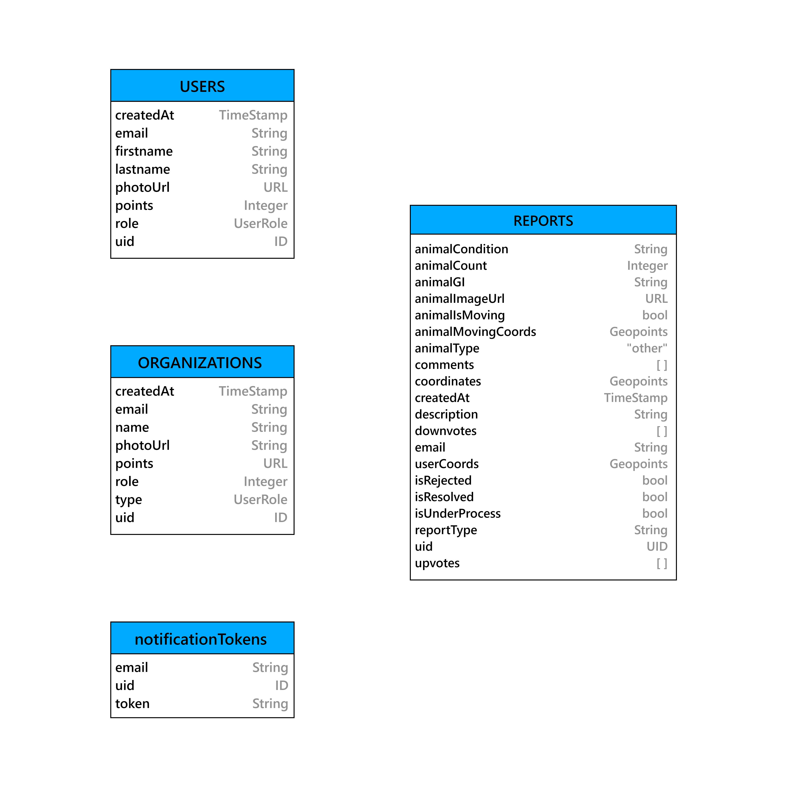
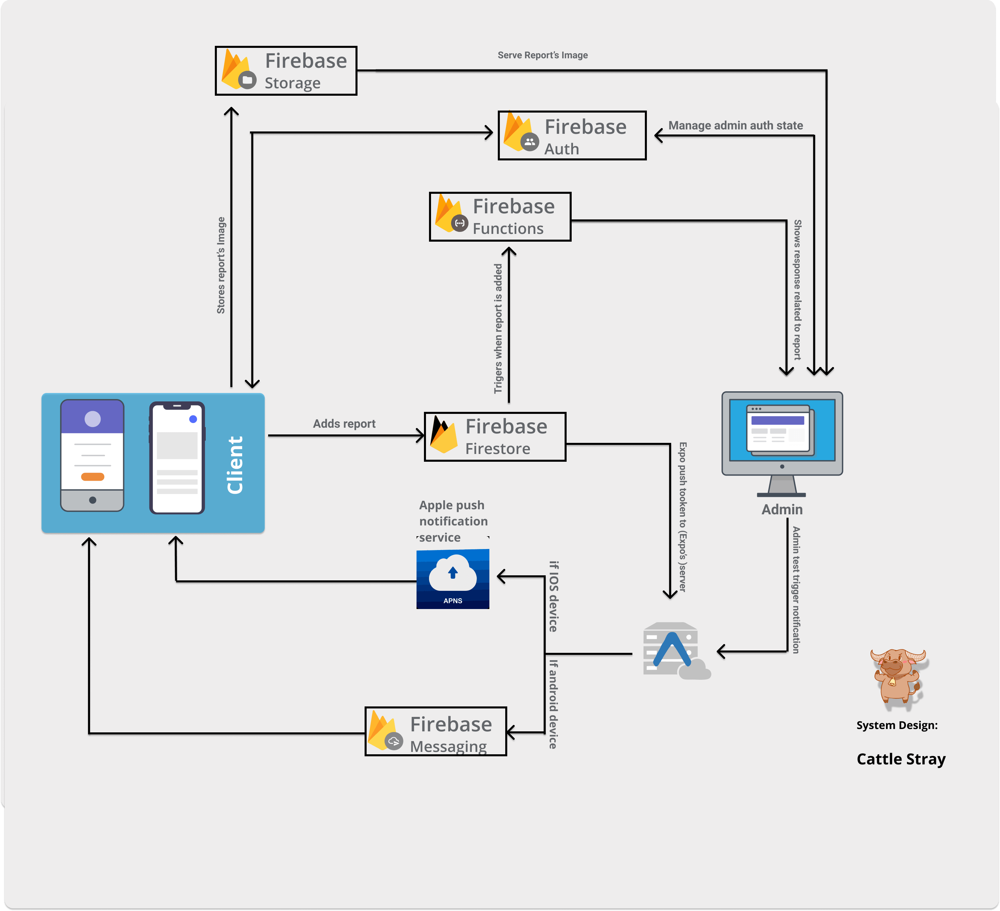

# A System For Reporting And Analysing Stray Cattle

## Useful Links

1. [Mobile Application Introduction Video](https://drive.google.com/file/d/1yYMROLk1Gjy5sufn4St07wV7QjP8AmZM/view?usp=sharing)
2. [Project Github](https://github.com/Ferin79/Cattle-Stray)
3. [APK File](https://drive.google.com/file/d/1kkF4HdrfCxnD7RVJFLUjuff9e1jgurEZ/view?usp=sharing)

 

# ABSTRACT

---

There’s a way for everything today but to count on injured animals or stray cattle roaming freely around streets. Not only stray cattle roaming around is injurious for mankind but accidents caused by men to animals on the street is something of an issue too. Stray cattle block roads terribly consequently disrupt mankind lives and sometimes they get hurt in return too which mercilessly takes their life too. With emerging technology in today’s world, there is no system currently available that takes stray cattle reports into accounts and works upon them as soon as possible in order to smoothen ours’ as well as their lives.

The presented project claims to take reports i.e. details of stray cattle from local people as input to the system and send those reports to the concerned stakeholders like NGOs, Veterinary, Animal Husbandries, etc. who can view or accept or reject or comment on these reports.

 

# INTRODUCTION

---

Stray cattle roaming around freely in the cities have become a serious menace. Several lives have already been lost and many have been injured due to accidents involving stray cattle. The root cause of the problem is the unplanned dairies, inside and around the city. The owners, after milking the cattle, leave them loose so that they can graze outside. Non-milking cattle are also left loose to save on their feed. The problem of stray cattle on roads is not new in India, and these animals often bring the flow of traffic on busy roads to a standstill along with major road accidents. Stray cattle roaming around freely in the cities have become a serious problem. The problems of impounding these cattle are many. The presence of stray cattle on roads, especially during the night hours is a common sight. They are there in the middle of the roads during the day as well and remain undeterred by vehicles passing by. Stray Cattle is not only bad for traffic congestion but also causes health hazards to the cattle.

The main issue for this problem is, there is disconnection between civil agencies, people and elected representatives. The government is not taking active participation for tackling the stray cattle problem. The bridge between local peoples and government should be filled using a platform which can be used to solve this issue.

The aim is to build a mobile based dynamic reporting system which will facilitate flow of information among all concerned stakeholders. This system creates a platform which coalesce the local people with Animal Husbandry, NGOs and Civic Forums.The local people can report stray cattle in nearby locations to these organizations, which in turn will act accordingly.

 

# THE APPLICATION

---

The best possible solution for this system would be creating mobile apps for local users and creating web apps for the admin side. The mobile apps would be more effective as well as easy to use. Using this mobile app, local users can report any stray cattle in their vicinity. Users will submit the information to the system about stray cattle in the form of reports. The report will contain information like:

- Type of cattle
- Approximate size of the herd
- Condition of animal
- Does animal have GI tag
- Is the cattle moving ?
- Animal Image

Using such minor but vital information we will be able to provide information to the stakeholders and government.

**What is a Report ?**

The information submitted by local people (users) about stray cattle using mobile.

## Types of report

Now the report can be bifurcated into two types based on type the user selects,

- General Report
- Health Issue Report

GENERAL REPORT

This category of report indicates the normal appearance of cattle in the neighborhood ,the system will treat it as a normal report and will just provide a notification on the dashboard of the stakeholders

HEALTH ISSUE REPORT

The health report is a priority report, it indicates either the cattle(s) are sick or the cattle(s) are causing health hazard to other people. Health reports will instantly fire a notification to stakeholders so that they can take actions instantly.

## Life cycle of report

The report, after submission by the user can be in one of the four stages:

- Submitted
- Processing
- Rejected
- Resolved

**Submitted Reports**

The report becomes a submitted report after successfully submitted by the user.

**Processing Reports**

The reports successfully delivered to the stakeholder and are waiting for an action are the in process reports.

**Rejected Reports**

The stakeholders can reject the report request according to the originality and genuineness of its details.

**Resolved Reports**

The reports which are genuine and are already acted upon are the resolved reports.

## Image Processing

As mentioned earlier, users need to fill out a lot of details in order to submit one report. This can be considered a tedious job to do and can take about 3-5 mins to fill a single report. To resolve this issue, I used image processing to detect all necessary fields in the report. Using this, i was able to recognized

- Type of animal
- Condition of animal
- Animal Count
- GI tag (in some cases)
- Location (directly taking user’s location)

**Google Cloud Vision**

Cloud Vision allows developers to easily integrate vision detection features within applications, including image labeling, face and landmark detection, optical character recognition (OCR), and tagging of explicit content.

## Schema

Fig: Schema for System

## Authentication of Report

There may be cases where multiple users spot cattle in same locality, multiple reports will create redundancy and there may be cases where some mischievous users report fake cattle presence, such cases must require disciplinary actions. To avoid maximum of such cases, we have added a feature of upvote and downvote.

**UPVOTE**

Suppose user A reported a herd of cattle at some location,now user B also spots a herd of cattle in the same locality, the application will automatically show an already existing report in user B’s screen, so he/she can upvote the report of user A.

**DOWNVOTE**

Similarly to upvote, downvote works the opposite way .If user X provides a fake report and a user Y spots no cattle in nearby areas, he/she can downvote the report.

**WHAT GOOD UPVOTE AND DOWNVOTE WILL DO?**

Introducing the feature of upvote and downvote, the manual work of removing redundancy as well authentication of reports can be reduced considerably. The reports with more upvotes will be displayed on top of the report list,while the reports with more downvotes will be prioritized least.

Prioritizing reports ensures that the reports which are genuine and require immediate actions ,are presented to the stakeholders at first.The health reports will have the highest priority,followed by the reports with highest upvotes and the reports with more downvotes will be the least.

## System Design

Fig: System Diagram

## Web App Access

Too much control to the users over the app will do more harm than good. So to manage the users, there is an admin role in the system.

The admins are classified into two categories namely,

- SUPER ADMIN ( The government itself )
- The organizations

**SUPER ADMIN**

The government will have the full access to all the data of the application. The role of super admin is very crucial , the super admin can add or remove organizations (stakeholders), keep a check on the user reports and many more disciplinary actions. Only the super admin will have access to the details of all the organizations and all the users.

**THE ORGANIZATIONS**

It is not feasible for the government to look at all the requests of reports submitted by the users, so a middleware is required who will answer the government and respond to the users. The sub admins or organizations like NGOs, will handle all the reports made by the users. Since there are multiple stakeholders of the system we have integrated a role based user system in which following roles are identified. However, the system is designed in a manner in which roles could be added further based on the requirements.

The organizations cannot access the information about the user who has reported, so the task of the organization is to respond to the pending requests. The reports will be displayed on the dashboard, the reports will be prioritized and presented.

>>>>>  gd2md-html alert: inline image link here (to images/image1.png). Store image on your image server and adjust path/filename/extension if necessary.  (<a href="#">Back to top</a>)(<a href="#gdcalert2">Next alert</a>) >>>>> 

Fig: Activity Diagram

>>>>>  gd2md-html alert: inline image link here (to images/image2.png). Store image on your image server and adjust path/filename/extension if necessary.  (<a href="#">Back to top</a>)(<a href="#gdcalert3">Next alert</a>) >>>>> 

Fig: Data Flow Diagram

## Data Clustering

Now we have all data in the form of reports (which are submitted by users) and we need to use machine learning clustering algorithms to get clusters of animals and other useful information from data. Using this data we can form clusters based on region and show animals clusters on maps. This will help the government to understand from where more stray animals are being reported and can take necessary actions.

Other than making clusters by region, timestamp of reporting is also an important factor. Clusters can be formed using timestamps and can be used to identify at what time most stray animals are being reported. For Example: One Cluster showing its center at 10:00 AM, so it means that around 10:00 AM at particular more animals are being reported. In order to implement this, I used a mean-shift clustering algorithm.

## Mean-Shift Clustering

Mean shift clustering is a sliding-window-based algorithm that attempts to find dense areas of data points. It is a centroid-based algorithm meaning that the goal is to locate the center points of each group/class, which works by updating candidates for center points to be the mean of the points within the sliding-window. These candidate windows are then filtered in a post-processing stage to eliminate near-duplicates, forming the final set of center points and their corresponding groups.

>>>>>  gd2md-html alert: inline image link here (to images/image3.png). Store image on your image server and adjust path/filename/extension if necessary.  (<a href="#">Back to top</a>)(<a href="#gdcalert4">Next alert</a>) >>>>> 

Fig: [Mean-Shift Clustering for a single sliding window](https://towardsdatascience.com/the-5-clustering-algorithms-data-scientists-need-to-know-a36d136ef68)

I applied a mean-shift algorithm on collected data (reports) and these are the clusters which are formed from it.

>>>>>  gd2md-html alert: inline image link here (to images/image4.jpg). Store image on your image server and adjust path/filename/extension if necessary.  (<a href="#">Back to top</a>)(<a href="#gdcalert5">Next alert</a>) >>>>> 

1. **Raw Data**

>>>>>  gd2md-html alert: inline image link here (to images/image5.jpg). Store image on your image server and adjust path/filename/extension if necessary.  (<a href="#">Back to top</a>)(<a href="#gdcalert6">Next alert</a>) >>>>> 

2. **Get centre of clusters, get dynamic bandwidth**

>>>>>  gd2md-html alert: inline image link here (to images/image6.jpg). Store image on your image server and adjust path/filename/extension if necessary.  (<a href="#">Back to top</a>)(<a href="#gdcalert7">Next alert</a>) >>>>> 

3. **Divide according to bandwidth**

>>>>>  gd2md-html alert: inline image link here (to images/image7.png). Store image on your image server and adjust path/filename/extension if necessary.  (<a href="#">Back to top</a>)(<a href="#gdcalert8">Next alert</a>) >>>>> 

>>>>>  gd2md-html alert: inline image link here (to images/image8.png). Store image on your image server and adjust path/filename/extension if necessary.  (<a href="#">Back to top</a>)(<a href="#gdcalert9">Next alert</a>) >>>>> 

>>>>>  gd2md-html alert: inline image link here (to images/image9.png). Store image on your image server and adjust path/filename/extension if necessary.  (<a href="#">Back to top</a>)(<a href="#gdcalert10">Next alert</a>) >>>>> 

---

>>>>>  gd2md-html alert: inline image link here (to images/image10.png). Store image on your image server and adjust path/filename/extension if necessary.  (<a href="#">Back to top</a>)(<a href="#gdcalert11">Next alert</a>) >>>>> 

---

# TECHNOLOGY STACK

---

**Mobile Application**

- React-Native (Expo)

**Web Application**

- ReactJS

**Backend**

- Firebase

<table>
  <tr>
   <td>

>>>>>  gd2md-html alert: inline image link here (to images/image11.png). Store image on your image server and adjust path/filename/extension if necessary.  (<a href="#">Back to top</a>)(<a href="#gdcalert12">Next alert</a>) >>>>> 

               React + Firebase
   </td>
   <td>

>>>>>  gd2md-html alert: inline image link here (to images/image12.png). Store image on your image server and adjust path/filename/extension if necessary.  (<a href="#">Back to top</a>)(<a href="#gdcalert13">Next alert</a>) >>>>> 

React-Native + Expo + Firebase
   </td>
  </tr>
</table>

## Useful Links

1. [Mobile Application Introduction Video](https://drive.google.com/file/d/1yYMROLk1Gjy5sufn4St07wV7QjP8AmZM/view?usp=sharing)
2. [Project Github](https://github.com/Ferin79/Cattle-Stray)
3. [APK File](https://drive.google.com/file/d/1kkF4HdrfCxnD7RVJFLUjuff9e1jgurEZ/view?usp=sharing)

# CONCLUSION

---

The system can be utilized in order to improve trafficking in a city. It not only ensures the safety of mankind but also animals. It reduces the manual task of authorities. Moreover, the application of Machine Learning algorithms makes it easier for the system to learn from the previous reports. The system is built as an Application Programming Interface (API) so it can get embedded to any relevant present system if it can.

# REFERENCE

---

1. [https://towardsdatascience.com/the-5-clustering-algorithms-data-scientists-need-to-know-a36d136ef68](https://towardsdatascience.com/the-5-clustering-algorithms-data-scientists-need-to-know-a36d136ef68)
2. [https://www.sih.gov.in/sih2020PS](https://www.sih.gov.in/sih2020PS)
3. [https://www.heraldgoa.in/Review/Stray-cattle-continue-to-be-a-menace-on-streets-of-Goa/164491](https://www.heraldgoa.in/Review/Stray-cattle-continue-to-be-a-menace-on-streets-of-Goa/164491)
4. [http://archive.indianexpress.com/news/cattle-menace---problem-and-solution/1163340/](http://archive.indianexpress.com/news/cattle-menace---problem-and-solution/1163340/)
5. [https://reactjs.org/docs/getting-started.html](https://reactjs.org/docs/getting-started.html)
6. [https://reactnative.dev/](https://reactnative.dev/)
7. [https://firebase.google.com/](https://firebase.google.com/)
8. [https://firebase.google.com/docs/ml-kit/label-images](https://firebase.google.com/docs/ml-kit/label-images)
9. [https://towardsdatascience.com/google-vision-api-for-image-analysis-with-python-d3a2e45913d4](https://towardsdatascience.com/google-vision-api-for-image-analysis-with-python-d3a2e45913d4)
10. [https://firebase.google.com/docs/reference/js](https://firebase.google.com/docs/reference/js)
